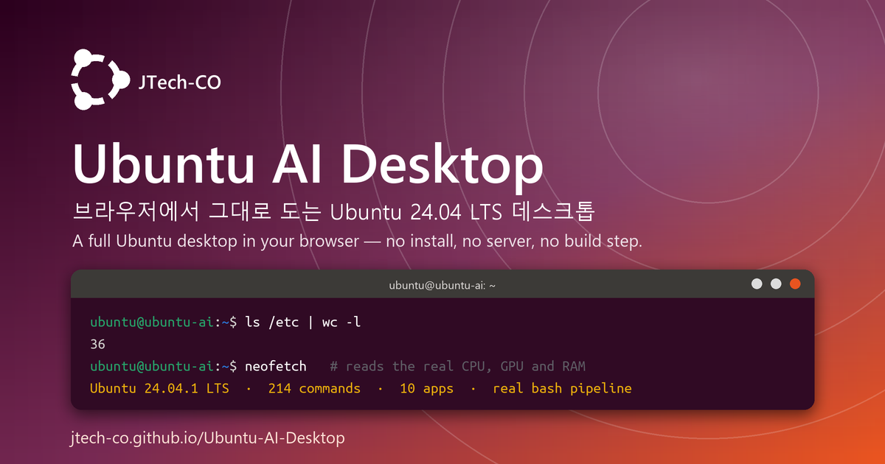

# Ubuntu AI Desktop

### ▶  **[Launch the desktop → jtech-co.github.io/Ubuntu-AI-Desktop](https://jtech-co.github.io/Ubuntu-AI-Desktop/)**

[](https://jtech-co.github.io/Ubuntu-AI-Desktop/)


[](https://github.com/JTech-CO/Ubuntu-AI-Desktop/actions/workflows/tests.yml)

[](https://jtech-co.github.io/Ubuntu-AI-Desktop/)

An Ubuntu 24.04 LTS (Noble Numbat) desktop emulator that runs entirely in the
browser as a static site — no build step, no bundler, no server-side code, just
native ES modules and plain CSS, so it deploys to GitHub Pages by pushing.

It is a *simulation*, not a virtual machine: there is no kernel and no real
package archive. What is real is the POSIX-ish filesystem every app shares, a
bash-style shell with pipes and redirection, and `python3`. So a file you create
in the terminal really does appear in Files, opens in the editor, and lands in
the trash when deleted.

```bash
ls -l ~/Pictures | wc -l          # a real pipeline, with real isatty(1) behaviour
cat ~/Desktop/help.txt            # the full tour, in Korean
neofetch                          # reads your machine's actual CPU, GPU and RAM
sudo apt install cowsay           # simulated archive, real file written to /usr/bin
```

---

## Running it

```bash
python serve.py
```

Then open <http://localhost:8321>. Opening `index.html` over `file://` will not
work — the browser refuses every `import` before the desktop can start. Any
static HTTP server does; `serve.py` is included because it also sends
`Cache-Control: no-store`, which saves you from editing a module, reloading, and
silently running the old code.

To publish: push the repository, then **Settings → Pages → Deploy from a branch**
with the `/ (root)` folder. `.nojekyll` is committed and every path in
`index.html` is relative, so a subdirectory URL works.

## The Gemini API key

The AI features (the `ai` command, Code-OSS's agent panel, Firefox's generated
pages) call the Google Gemini API directly from the browser. Get a key at
<https://aistudio.google.com/apikey> and paste it into **Settings → AI
Configuration**; it is stored in that browser's `localStorage` under
`uad:apikey`. Everything else works with no key at all.

- **Never commit a key or bake one into the page.** A Pages site is public and
  unminified, so anyone can read the source or the network tab. `.gitignore`
  covers `key.txt`, `*.key` and `.env`.
- Restrict the key to your Pages domain with an HTTP referrer rule in AI Studio.
- If a key has ever been committed, rotate it — deleting the file in a later
  commit does not remove it from git history.

---

## Applications

**Terminal** — tabbed gnome-terminal with a real shell (see below).
**Files** — Nautilus-style browser: grid and list views, rename, cut/copy/paste,
undo, drag and drop, properties, Open in Terminal, trash.
**Text Editor** — tabbed, dirty tracking, find and replace, line numbers.
**Image Viewer** — Eye of GNOME: zoom, pan, rotate, slideshow, Set as Wallpaper.
**Code - OSS** — VS Code-style editor with highlighting, file tree, integrated
terminal, and a Gemini agent panel.
**Firefox** — **Live web** (default) really loads sites, searches and plays
YouTube; **AI simulation** keeps the Gemini-generated pages, labelled as such.
**System Monitor** — processes, live resource charts, file systems.
**Settings** — appearance, background, dock, AI configuration, about.
**Calculator** — basic and advanced modes with a real expression parser.
**Trash** — freedesktop.org trash with restore and permanent delete.

Press `Alt`+`F2` for GNOME's run dialog, and read `~/Desktop/help.txt` (Korean)
for a full tour from inside the desktop.

## What is real, and what is simulated

**Real** — the filesystem shared by every app; the shell's tokeniser, expansion,
pipes, redirection, globbing and subshells; GNU output formats and error strings;
`isatty(1)`, so `ls | wc -l` counts files; the window manager's eight-way resize,
snapping and tiling; the host's hardware as far as the browser reports it;
`python3`; and Firefox's live mode.

**Simulated** — no kernel and no process table (`ps`/`top` read a model); `apt`
installs from a fake archive, and the file it writes into `/usr/bin` is not
executable code; the network commands (`ping`, `dig`, `traceroute`) invent
plausible output; and Code-OSS's Run button asks Gemini to act as an interpreter
for JavaScript, C, C++ and Java (shell scripts and Python run for real).

Where the browser will not tell the truth, the UI says so instead of inventing a
number: the CPU model string is not exposed to web content at all, memory is
bucketed to a power of two and labelled "approx.",
`navigator.storage.estimate()` is the browser's quota rather than the disk, and a
GPU masked by `resistFingerprinting` is shown as masked.

Firefox's live mode is bounded by what a page may do. Most large sites (Google,
YouTube watch pages, most news and social sites) refuse to be framed; the app
detects that and offers to open the real tab rather than pretending to have
rendered them. YouTube playback works through the `youtube-nocookie` embed.
Search is real and keyless — Wikipedia, Stack Exchange and Hacker News — and each
engine fails independently.

### Python

`python3` is real CPython 3.12.7, compiled to WebAssembly by
[Pyodide](https://pyodide.org) 0.27.7 and run in a Web Worker so a busy program
never freezes the page. The first run downloads about 6 MB from
`cdn.jsdelivr.net`, then the browser caches it.

- `python3` alone opens the interactive interpreter; `python3 file.py`,
  `-c`, `-m json.tool`, piped scripts, `-i` and `./script.py` (through its
  shebang) all work, as does Code-OSS's Run button.
- Programs see the desktop's files: home, `/tmp` and the working directory are
  mirrored in, and what the program writes there is saved back.
- `input()` reads the terminal. Python can only block for it through a
  synchronous request, so `sw.js` — a service worker that caches nothing — holds
  that request open until you press Enter; `time.sleep()` uses the same channel.
- As on a fresh Ubuntu, only the standard library is installed. Ctrl+C stops a
  program by terminating the worker, so `KeyboardInterrupt` cannot be caught and
  the interpreter's variables are lost. There are no sockets, `subprocess` or
  `os.fork`.

---

## The terminal

The shell is not a switch statement over command names. It tokenises with proper
quote and escape handling, expands in bash's order (tilde → parameter → command
substitution → word splitting → globbing), parses into an AST, and executes
pipelines.

Supported: `|`, `>`, `>>`, `<`, `2>`, `2>&1`, `&&`, `||`, `;`, trailing `&`,
`$VAR`, `${VAR}`, `${VAR:-default}`, `$?`, `$(…)`, backticks, `*`, `?`, `[abc]`,
`~`, aliases, `# comments`, here-strings (`<<< "text"`) and here-documents
(`<<EOF`, `<<'EOF'`, `<<-EOF`, with a `> ` prompt until the delimiter arrives).
Binary data survives pipes and redirection, so `tar czf - dir | tar tzf -` keeps
every byte and the result opens with the real tools on any machine.

Line editing has history (persisted to `~/.bash_history`), tab completion for
commands and paths, reverse-i-search with `Ctrl+R`, and the usual Emacs keys.

### Commands

**Builtins** `cd pwd export unset alias unalias source . exit logout history jobs
fg bg wait set shopt type command eval help true false :`

**Files** `ls cat tac head tail wc cp mv rm mkdir rmdir touch ln find tree du df
stat file chmod chown realpath readlink basename dirname mktemp`

**Text** `echo printf grep egrep fgrep sed awk mawk nawk sort uniq cut tr rev tee
diff nl less more paste column fold split join comm shuf`

**Shell tools** `env printenv expr xargs clear`

**Archives** `tar gzip gunzip zcat zip unzip` — GNU tar format, gzip with a real
header and CRC, zip with deflate. bzip2, xz and zstd say they are not implemented.

**Python** `python3` (`python3.12`) — real CPython, see [Python](#python) above.

**JSON** `jq` (1.7.1) — like a fresh Ubuntu, not installed until you run
`sudo apt install jq`.

**System** `uname whoami id hostname hostnamectl uptime date cal ncal free ps top
kill pkill killall pgrep pidof which whereis man lscpu lsblk lsusb lspci lsmod
mount dmesg systemctl journalctl timedatectl lsb_release locale nproc arch tty
stty groups su sudo neofetch fastfetch screenfetch`

**Network** (simulated) `ping ifconfig ip netstat ss curl wget dig nslookup host
traceroute tracepath arp route nmcli`

**Packages** (simulated archive) `apt apt-get apt-cache dpkg dpkg-query snap
add-apt-repository apt-add-repository do-release-upgrade`

**AI** (needs a key) `ai ask gemini explain gencode summarize summarise translate`

**Misc** `sleep seq yes bc md5sum sha256sum base64 xxd watch time xdg-open nano
vim vi gedit gnome-text-editor code nautilus gnome-files firefox cowsay cowthink
figlet banner fortune reboot poweroff halt shutdown`

**Emulator-only** `reset github` — `reset` is a factory reset for the desktop
(`--all` also discards the API key, `-y` skips the confirmation; real `reset(1)`
only reinitialises the terminal, which is `clear` here), and `github` is a
scripted demo that drives Firefox by itself. Their man pages say so.

That is 190 external commands plus 24 builtins — 214 in all, or 229 names
counting aliases. Run `help` for the live list, or `man <command>` for a page.
`apt install` really writes a binary into `/usr/bin`, so `which` finds it
afterwards and `apt remove` deletes it; without `sudo` it prints the genuine
dpkg lock error.

### Known limitations

These are deliberate, and the commands tell you rather than pretending:

- **Nothing reaches the network** except the Gemini API and, on the first
  `python3` run, the Pyodide runtime. `curl`, `wget`, `ping` and `dig` return
  generated or canned responses.
- **`bc`** uses JavaScript doubles, so `scale` is honoured to about 15 decimal
  places, and `define`/`if`/`while`/`for` are not implemented.
- **`yes`** is capped at a million lines so a piped `yes` cannot freeze the tab;
  **`xxd -r`** is not implemented; **`tar`** handles `-c -x -t -r` only.
- **Code-OSS "Run"** really runs shell scripts and Python; other languages are
  sent to Gemini and labelled as AI-simulated.
- **`./script.sh`** runs like `source`: this shell has no control-flow grammar
  (`if`, `for`, `while` are skipped) and no subshell, so a script's variables
  stay set afterwards. Another `#!` interpreter (`python3`, `awk -f`) runs
  through it.
- **`ai … | grep`** pipes the progress spinner along with the answer, because a
  command has a single output channel.
- **`awk`** measures strings in characters; the real mawk counts bytes.
- **`jq`** stops a filter after 15 seconds, and integers beyond 2^53 lose
  precision (real jq keeps the literal).

---

## Keyboard

| Keys | Action |
| --- | --- |
| `Super` | Activities overview |
| `Super`+`A` | Application grid |
| `Alt`+`Tab` | Cycle windows |
| `Super`+`←` / `→` | Tile left / right |
| `Super`+`↑` / `↓` | Maximise / restore |
| `Super`+`D` | Show desktop |
| `Super`+`L` | Lock screen (password: `ubuntu`) |
| `Ctrl`+`Alt`+`T` | New terminal |
| `Alt`+`F2` | Run a command (GNOME's run dialog) |
| `Alt`+`F4` | Close window |
| `Print` | Screenshot |
| `Esc` | Leave the emulator, when the keyboard is locked |

`Ctrl+T`, `Ctrl+W` and `Ctrl+N` belong to the browser and a page cannot cancel
them. The only API that changes this is **Keyboard Lock**, which works in
fullscreen only, needs a user gesture (**키보드 잠그기** in the top bar), and is
Chromium-only — elsewhere the indicator explains itself instead of failing. Three
ways back out: a short `Esc` (asks first), a long `Esc` (~2 s, browser-enforced
and undeniable), or the power button at the top left, which shuts the machine
down and returns the keyboard immediately. That button is a departure from GNOME,
which keeps shutdown in the system menu — that menu still works — but a desktop
inside a browser tab needs one always-visible way out.

`Print` takes a **real** screenshot through `getDisplayMedia`, so the browser
asks which surface to share; the result is saved to `~/Pictures/Screenshots/`.
Cancelling writes nothing, and where the API is unavailable it writes a
placeholder that says on its face that it is one. The simulated `sudo` password
is also `ubuntu`.

---

## Where your files are kept

The filesystem is saved to **IndexedDB**; settings, the API key and the session
stay in `localStorage`, which is capped at about 5 MiB — one full-HD screenshot
is 1–4 MB as a data URL, so a filesystem kept there used to fill up and fail
silently.

- Files of 16 KB and up are stored as separate records, and a save rewrites only
  the ones that changed.
- A failed save raises a notification that stays until a later save succeeds,
  with shortcuts to free space. Trashed files still occupy storage.
- Existing desktops migrate on first load. If IndexedDB cannot be opened at all,
  saving falls back to `localStorage` and says so.
- **Two tabs** are safe: the first saves, the second becomes read-only and offers
  **Use here** to take over.

To wipe everything, run `reset` in the terminal or `UAD.reset()` in the browser
console; both clear IndexedDB and `localStorage` and reload. `window.UAD` also
exposes `fs`, `wm`, `procs`, `env`, `bus`, `store`, `gemini`, `metrics`,
`notify`, `settings` and `apps` for poking around.

## Tests

```bash
npm test          # node --test "tests/*.test.mjs" — Node 22+, nothing to install
```

The suites load the desktop's own modules under Node with a few browser globals
shimmed, open a real shell session and type command lines into it: shell
expansion and redirection, the filesystem, 93 awk programs, the jq 1.7 manual's
examples and error texts, and gzip/tar/zip round trips.

```bash
node tests/differential.mjs
```

compares the emulator with the real programs installed on the machine — awk, jq,
`tar`, `gzip`, `unzip` — and exits non-zero on a difference that is not
documented. GitHub Actions runs both on Ubuntu 24.04 for every push, where the
references are the actual mawk 1.3.4 and jq 1.7.1. `python3` needs a browser, so
only its option handling is in the suite.

## Extending

[`docs/ARCHITECTURE.md`](docs/ARCHITECTURE.md) is the contract every module is
built against — the directory layout (§1), the filesystem (§6), the app module
contract (§16) and the terminal's shell and command objects (§17).

- **An application** is `js/apps/<id>/index.js` with a default export
  (`id`, `name`, `icon`, `mount(root, ctx)`), listed in `js/apps/registry.js`.
  The dock, the overview and the window manager pick it up from there.
- **A command** is an object (`name`, `synopsis`, `man`, `async run(ctx)`
  returning `{ stdout, stderr, code }`) in one of the arrays under
  `js/apps/terminal/commands/`. `ctx` carries `argv`, `stdin`, `stdoutIsTTY`,
  `env`, `fs`, `term`, `signal` and a `run()` helper; long-running commands must
  watch `ctx.signal` so `Ctrl+C` works, and drop decoration when
  `ctx.stdoutIsTTY` is false.
